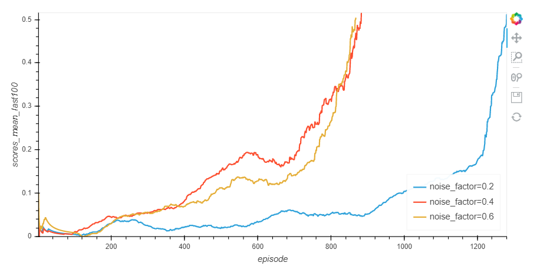
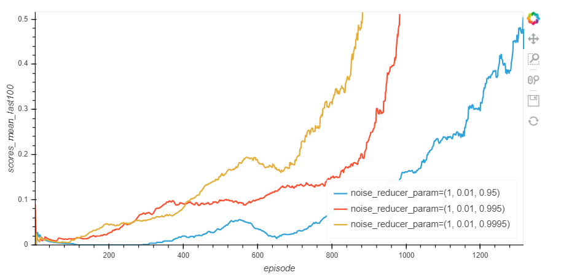
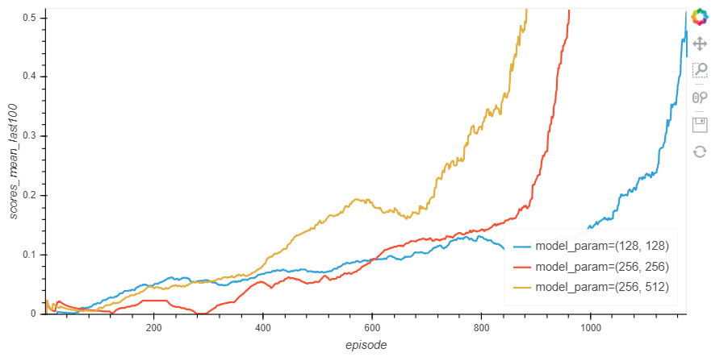
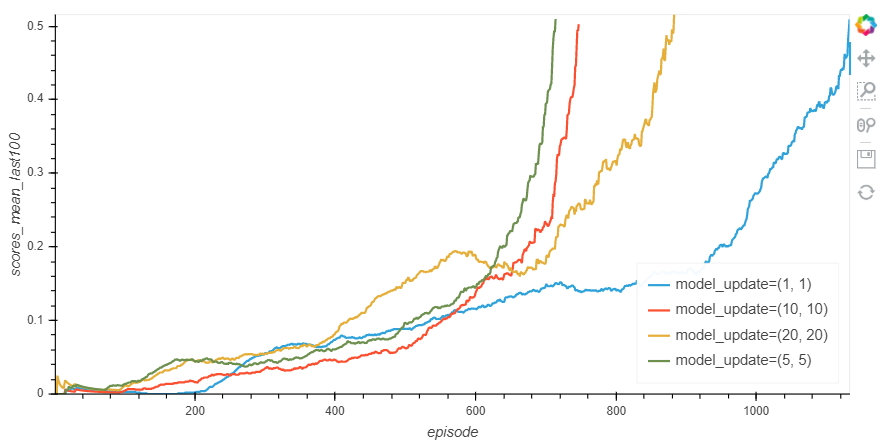

# collab-compet report  

## Description of the implementation

First of all, the implementation is based on the udacity implementation of the DDPG algorithm (see the [github](https://github.com/udacity/deep-reinforcement-learning/tree/master/ddpg-pendulum) for more details).

My repository contains the following files :
> - train_agent.py: this file is dedicated to run a training process for an agent. It loads the environment and then run the training.
> - agent.py: this file implements the MultiActorCriticAgent class. It uses the DDPG algorithm (see the next part for more informations)
> - models.py: this file contains the model used for the actor network and for the critic one.
> - noise.py: this file contains classes dedicated to handle the noise used in the training process.
> - parameters.py: this file contains a class that defines training parameters.
> - Training Analysis.ipynb: this notebook is usefull to test training with different parameters and compare all of them
> - train.py: this file contains the method applied to run the training. You doesn't have to call directly this file. You should use either the *train_agent.py* file or the *Training Analysis.ipynb* notebook.

I decided to use tha same network for the actor for both agent. It's the same for the critic and the replay buffer. The main reason is that both agent has a common goal. Moreover, The states are symmetrical. It means that learning something for one agent is also valid for the other agent. 

## Learning Algorithm

The learning algorithm chose for this project is the DDPG one. Find more details on the [DDPG paper](https://arxiv.org/abs/1509.02971).

Here you find the main ideas of this algorithm:
- This algorithm is often classified as an actor critic algorithm. 
	- The objective of the actor part is to select the action to apply given a specified state.
	- The objective of the critic part is to estimate the expected return for a given couple (state, action)

As already indicated previously, we use the same actor and the same critic for both agent for two reasons :
- They have the same objective
- The states are "symmetrical" 

After having taken a decision (apply action **a** from state **s**), the learning process works as follow with the environment feedbacks:
- To remind, the environment feedbacks for each agent are:
	- the new state s+1
	- the reward
	- a boolean indicating if the episode is finished or not
- The *actor* select the action **a+1** to apply in state **s+1**
- The *critic* estimate the expected return for the state **s+1** and the action **a+1**
- The *critic* compare the expected return for the state **s** and the action **a** with the **reward** + the expected return for the state **s+1** and the action **a+1**. The difference between these values is used to update the wait of the *critic* network.
- Then the weight of the actor network are updated. The actor as the particularity to directly define the policy. In order to update its weights, we compute the loss function as *minus* the expected return estimated by the *critic* for tha state *s* and the action *a* returned by the *actor*. We apply a minus given that the *actor* try to maximize the return instead of minimizing it.
- Finaly, as for the DQN algorithm, the DDQN used fixed Q-targets. It means that two networks are used for the *actor* and for the *critic*. The main objective is to stabilize the learning process. One network is trained (name local in the code) and the other one is used to defined the target (name target in the code).

As indicated before, the code is mainly based on the udacity implementation of this algorithm.

The main changes I did are the following :
- I used a Gaussian noise instead of the *OUNoise*
- I initialized the target model weights with the local ones for the critic part and the actor one.
- I used the "clip_grad_norm" on the gradient for the critic.
- I added the update parameters. The idea is to apply the learn process not after each step but after every **n** steps. Moreover, The second parameter indicate how many batch I sent to the learning process each time.

Regarding the network structure, I started with the udacity implementation.

### The actor networks
- The actor networks received as input the state
- Then it contains two fully connected hidden layers
- The relu activation function is used except for the output layers that used the tanh activation function (we need a value between -1 and 1 for each output values)
- The output size correspond to the action size.

### The critic networks
- The critic networks is nearly the same. There are only three differences :
	- the output size is equal to one (given that we want the expected return for a given couple (state, action))
	- There are no output activation function.
	- The first hidden layer is concatenated with the **"action input"** and is fully connected to the second hidden layer.

Then, I mainly changed the parameters values to solve the environment.

I tested different parameterization to train both agents. However, few of them allow me to solve the environment. The most important ones that helps me to get good results are the noise parameters. I used a Gaussian noise with a factor that define the standard deviation of the noise. Here you find a comparison on different values for that parameter.

The graph shows how the mean score evolves for each episode:

I got the best results by applying a noise factor equal to 0.4.

Regarding the noise, another parameter indicate how fast I decrease the noise. Here you find the results observed for a noise factor equal to 0.4:

The first value indicate the initial rate applied, the second one indicates the minimum value for that rate and the last one indicates the decrease rate after each episode. We see that we got the best results by decreasing slowly the noise factor (1, 0.01, 0.9995)

Then I tried different sizes of hidden layers. I made the same modification for the actor and the critic networks. Here you find the results I got :

I got the best results with the (256, 512) values (it means a size of 256 for the first hidden layer and 512 for the second one). 

Finally, I also tried different values for the "learning process". The idea is to apply the learning process not every step but every **n** steps. Each time we apply send several random batches from the replay buffer. Here you find the results observed:

Applying 5 times the learning processe every 5 steps gave us the best result in our case. 

Finally, these adjustements allowed me to solve the environment in **614 episodes**. The average score from the 615 one to the 714 one is 0.509.

The checkpoint files of this repository correspond to that experiment.

## Plot of Rewards
This graph represents the mean score on the 100 previous episodes of the best result (the value at episode 700 is the mean score of the episodes between 601 and 700). At iteration 714, the target value to solve the environment is reached.

## Ideas for Future Work
In order to improve the agent's performance, I would like to test several ideas.
> - The first one is the use of a prioritized Experience replay. The non zero rewards are scares and using this kind of technics could help a lot to converge faster. 
> - The DDPG algorithm was really efficient for that environment. However, it was not easy to find the good tunning to succeed. The first results were not good and we could asssume that this algorithm were not the good one. What could be nice is to implement a process to automatically tune the parameters in order to find the best set of parameter to apply.
> - It could be nice as well to test others algorithms on this environment with continuous action space and compare the results.